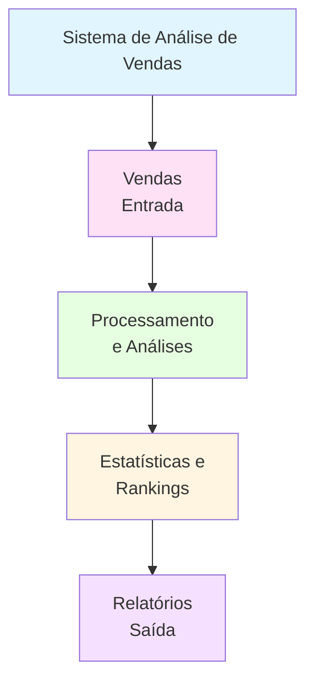

# Projeto 02: Sistema de Análise de Vendas de Loja

## 📋 Objetivo

Desenvolver um sistema para análise de vendas de uma loja que permita registrar vendas, calcular estatísticas de vendas por vendedor, produto e período, além de identificar produtos mais vendidos e melhores vendedores.

## 🗺️ Diagrama de Contexto



## 🔧 Funcionalidades Básicas

1. **Cadastro de Vendas**
   - Registrar venda (produto, vendedor, quantidade, valor unitário, data)
   - Calcular valor total da venda automaticamente
   - Validar dados de entrada

2. **Análises por Vendedor**
   - Total de vendas por vendedor
   - Quantidade de vendas por vendedor
   - Valor médio por venda por vendedor
   - Ranking de vendedores

3. **Análises por Produto**
   - Total vendido por produto
   - Quantidade total vendida por produto
   - Produtos mais vendidos (ranking)
   - Receita por produto

4. **Análises Temporais**
   - Vendas por mês
   - Comparação entre períodos
   - Identificar melhor mês de vendas

5. **Relatórios**
   - Relatório geral de vendas
   - Relatório por vendedor
   - Relatório por produto
   - Relatório mensal

## 📊 Estrutura de Dados

### Entrada

```python
# Venda individual
venda = {
    'id': 1,
    'produto': 'Notebook Dell',
    'vendedor': 'Maria Silva',
    'quantidade': 2,
    'valor_unitario': 3500.00,
    'data': '2024-01-15'
}
```

### Saída

```python
# Lista de vendas
vendas = [
    {
        'id': 1,
        'produto': 'Notebook Dell',
        'vendedor': 'Maria Silva',
        'quantidade': 2,
        'valor_unitario': 3500.00,
        'valor_total': 7000.00,
        'data': '2024-01-15'
    },
    # ... mais vendas
]

# Estatísticas por vendedor
estatisticas_vendedor = {
    'Maria Silva': {
        'total_vendas': 12500.00,
        'quantidade_vendas': 3,
        'valor_medio': 4166.67
    }
}

# Estatísticas por produto
estatisticas_produto = {
    'Notebook Dell': {
        'total_vendido': 14000.00,
        'quantidade_vendida': 4,
        'receita': 14000.00
    }
}
```

## 💻 Requisitos Técnicos

- Python 3.8+
- Conhecimentos em:
  - Tipos de dados (int, float, str, dict, list)
  - Estruturas de controle (if/else, for, while)
  - Funções com parâmetros e retorno
  - Compreensões de lista e dicionário
  - Funções lambda, map, filter
  - Operações com strings (formatação de datas)

## 📦 Entregáveis

1. **Código Python** (`sistema_vendas.py`)
   - Módulo completo com todas as funcionalidades
   - Funções bem documentadas
   - Validações de entrada

2. **Dados de Exemplo** (`vendas_exemplo.txt`)
   - Arquivo com vendas de exemplo
   - Formato estruturado

3. **Relatórios Gerados** (`relatorios/`)
   - Relatório geral
   - Relatório por vendedor
   - Relatório por produto

4. **Documentação** (`README.md`)
   - Instruções de uso
   - Exemplos práticos

## 💡 Dicas

1. Use dicionários aninhados para organizar estatísticas
2. Use list comprehension para filtrar vendas
3. Use dict comprehension para agrupar dados
4. Implemente funções auxiliares:
   - `calcular_valor_total()` - calcula valor total da venda
   - `extrair_mes()` - extrai mês da data
   - `formatar_moeda()` - formata valores monetários
5. Use `sorted()` com `key` para criar rankings
6. Use `max()` e `min()` para encontrar extremos
7. Agrupe vendas usando dicionários como chave

## 🏗️ Esqueleto do Projeto

```python
# sistema_vendas.py

# ============================================
# Sistema de Análise de Vendas
# ============================================

vendas = []
contador_id = 1

# ============================================
# FUNÇÕES DE CADASTRO
# ============================================

def registrar_venda(produto, vendedor, quantidade, valor_unitario, data):
    """
    Registra uma nova venda.
    
    Args:
        produto (str): Nome do produto
        vendedor (str): Nome do vendedor
        quantidade (int): Quantidade vendida
        valor_unitario (float): Valor unitário
        data (str): Data da venda (YYYY-MM-DD)
    
    Returns:
        dict: Venda registrada
    """
    global contador_id
    
    # TODO: Validar entradas
    # TODO: Calcular valor total
    # TODO: Criar dicionário da venda
    # TODO: Adicionar ID
    # TODO: Adicionar à lista
    # TODO: Incrementar contador
    pass

# ============================================
# FUNÇÕES DE CÁLCULOS
# ============================================

def calcular_total_vendas():
    """
    Calcula o total geral de vendas.
    
    Returns:
        float: Total de todas as vendas
    """
    # TODO: Usar list comprehension para extrair valores
    # TODO: Usar sum() para somar
    pass

def calcular_vendas_por_vendedor():
    """
    Calcula estatísticas de vendas por vendedor.
    
    Returns:
        dict: {vendedor: {total, quantidade, media}}
    """
    # TODO: Agrupar vendas por vendedor
    # TODO: Calcular totais e médias
    # TODO: Usar dict comprehension
    pass

def calcular_vendas_por_produto():
    """
    Calcula estatísticas de vendas por produto.
    
    Returns:
        dict: {produto: {total, quantidade, receita}}
    """
    # TODO: Agrupar vendas por produto
    # TODO: Calcular estatísticas
    pass

def calcular_vendas_por_mes():
    """
    Calcula vendas agrupadas por mês.
    
    Returns:
        dict: {mes: total_vendas}
    """
    # TODO: Extrair mês de cada venda
    # TODO: Agrupar por mês
    # TODO: Somar valores
    pass

# ============================================
# FUNÇÕES DE RANKINGS
# ============================================

def ranking_vendedores(limite=5):
    """
    Gera ranking dos melhores vendedores.
    
    Args:
        limite (int): Quantidade de vendedores no ranking
    
    Returns:
        list: Lista de tuplas (vendedor, total)
    """
    # TODO: Calcular vendas por vendedor
    # TODO: Ordenar por total (decrescente)
    # TODO: Retornar top N
    pass

def ranking_produtos(limite=5):
    """
    Gera ranking dos produtos mais vendidos.
    
    Args:
        limite (int): Quantidade de produtos no ranking
    
    Returns:
        list: Lista de tuplas (produto, quantidade)
    """
    # TODO: Calcular vendas por produto
    # TODO: Ordenar por quantidade (decrescente)
    # TODO: Retornar top N
    pass

def melhor_mes():
    """
    Identifica o mês com maior volume de vendas.
    
    Returns:
        tuple: (mes, total)
    """
    # TODO: Calcular vendas por mês
    # TODO: Usar max() para encontrar o maior
    pass

# ============================================
# FUNÇÕES DE RELATÓRIOS
# ============================================

def gerar_relatorio_geral():
    """
    Gera relatório geral de vendas.
    
    Returns:
        dict: Dicionário com todas as informações
    """
    # TODO: Calcular todas as estatísticas
    # TODO: Criar dicionário de relatório
    pass

def gerar_relatorio_vendedor(nome_vendedor):
    """
    Gera relatório específico de um vendedor.
    
    Args:
        nome_vendedor (str): Nome do vendedor
    
    Returns:
        dict: Estatísticas do vendedor
    """
    # TODO: Filtrar vendas do vendedor
    # TODO: Calcular estatísticas
    pass

def exibir_relatorio_vendas():
    """
    Exibe relatório formatado no console.
    """
    # TODO: Formatar e exibir informações
    # TODO: Usar f-strings para formatação
    pass

# ============================================
# FUNÇÕES AUXILIARES
# ============================================

def formatar_moeda(valor):
    """
    Formata valor como moeda brasileira.
    
    Args:
        valor (float): Valor a formatar
    
    Returns:
        str: Valor formatado (R$ X.XXX,XX)
    """
    # TODO: Formatar com 2 casas decimais
    # TODO: Adicionar símbolo R$
    pass

def extrair_mes(data):
    """
    Extrai o mês de uma data no formato YYYY-MM-DD.
    
    Args:
        data (str): Data no formato YYYY-MM-DD
    
    Returns:
        str: Mês no formato YYYY-MM
    """
    # TODO: Usar split() ou slicing
    pass

# ============================================
# FUNÇÃO PRINCIPAL
# ============================================

def main():
    """
    Função principal do programa.
    """
    # TODO: Menu interativo
    # TODO: Opções: registrar, relatórios, rankings, sair
    pass

if __name__ == "__main__":
    main()
```

## 📝 Exemplo de Uso

```python
# Registrar vendas
registrar_venda('Notebook Dell', 'Maria Silva', 2, 3500.00, '2024-01-15')
registrar_venda('Mouse Logitech', 'João Santos', 5, 89.90, '2024-01-16')
registrar_venda('Teclado Mecânico', 'Maria Silva', 3, 250.00, '2024-01-17')

# Gerar relatório
relatorio = gerar_relatorio_geral()
print(f"Total de vendas: {formatar_moeda(relatorio['total'])}")

# Ver ranking
top_vendedores = ranking_vendedores(3)
print("Top 3 Vendedores:")
for vendedor, total in top_vendedores:
    print(f"{vendedor}: {formatar_moeda(total)}")
```

